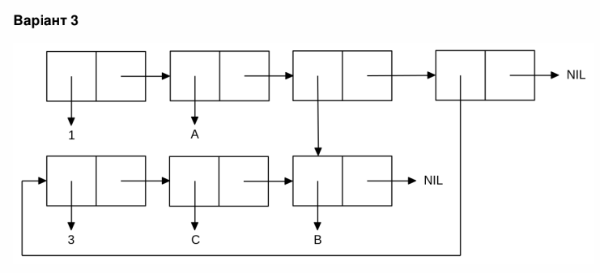

<p align="center"><b>МОНУ НТУУ КПІ ім. Ігоря Сікорського ФПМ СПіСКС</b></p>

<p align="center">
<b>Звіт з лабораторної роботи 1</b><br/>
"Обробка списків з використанням базових функцій"<br/>
дисципліни "Вступ до функціонального програмування"
</p>

<p align="right">**Студент**: *Гармаш Дмитро Олегович КВ-13*<p>
<p align="right">**Рік**: *2024*<p>


  ## Загальне завдання 

  ### Пункт 1
  Створіть список з п'яти елементів, використовуючи функції LIST і CONS . Форма
створення списку має бути одна — використання SET чи SETQ (або інших
допоміжних форм) для збереження проміжних значень не допускається. Загальна
кількість елементів (включно з підсписками та їх елементами) не має перевищувати
10-12 шт. (дуже великий список робити не потрібно). Збережіть створений список у
якусь змінну з SET або SETQ . Список має містити (напряму або у підсписках):

- хоча б один символ

- хоча б одне число

- хоча б один не пустий підсписок

- хоча б один пустий підсписок

#### Пункт 2
  Отримайте голову списку.
#### Пункт 3
  Отримайте хвіст списку.
#### Пункт 4
  Отримайте третій елемент списку.
#### Пункт 5
  Отримайте останній елемент списку.
#### Пункт 6
  Використайте предикати ATOM та LISTP на різних елементах списку (по 2-3
приклади для кожної функції).
#### Пункт 7
  Використайте на елементах списку 2-3 інших предикати з розглянутих у розділі 4
навчального посібника.
#### Пункт 8
  Об'єднайте створений список з одним із його непустих підсписків. Для цього
використайте функцію APPEND .
  
```lisp 
;;Пункт 1
(defvar taskone-list nil)
(setq taskone-list (list 's 1 (list 1 2) () 's1))
(format t "~a~%" taskone-list)

;;Пункт 2
(defvar head nil)
(setq head (first taskone-list))
(format t "~a~%" head)

;;Пункт 3
(defvar tail nil)
(setq tail (cdr taskone-list))
(format t "~a~%" tail)

;;Пункт 4
(defvar third-element nil)
(setq third-element (nth 2 taskone-list))
(format t "~a~%" third-element)

;;Пункт 5
(defvar last-element nil)
(setq last-element (first (last taskone-list)))
(format t "~a~%" last-element)

;;Пункт 6
(format t "First elem check: ~a~%" (atom (first taskone-list)))
(format t "Third elem check: ~a~%" (atom (nth 2 taskone-list)))
(format t "Fourth elem check ~a~%" (atom (nth 3 taskone-list)))
(format t "List check: " (listp (first taskone-list)))
(format t "Third elem check: ~a~%" (listp (nth 2 taskone-list)))
(format t "Fourth elem check: ~a~%" (listp (nth 3 taskone-list)))

;;Пункт 7
(format t "Fourth elem check: ~a~%" (equalp (nth 2 taskone-list) (nth 3 taskone-list)))
(format t "Is 1 equal to zero? ~a~%" (zerop (nth 1 taskone-list)))

;;Пункт 8
(defvar sublist (nth 2 taskone-list))
(defvar combined-list (append taskone-list sublist))
(format t "~a~%" combined-list)
```
## Варіант 3
<p align="center">

</p>

```lisp
(setq sublist (list 3 'c 'b))
(setq main-list (list 1 'a (last sublist) sublist))
```
